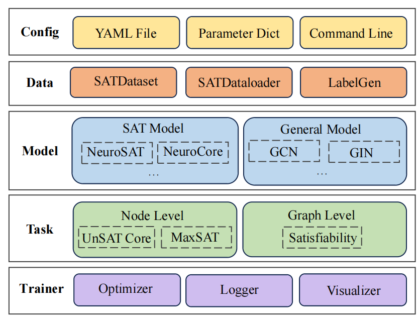

A Pipeline of SATGL
=========================

We define five components:
:ref:`config-introduction`,
:ref:`pipeline-data`,
:ref:`pipeline-task`,
:ref:`pipeline-model`,
:ref:`pipeline-trainerFlow`

.. toctree::
   :maxdepth: 2
   :titlesonly:

   config/index
   data
   task
   model
   trainerFlow

