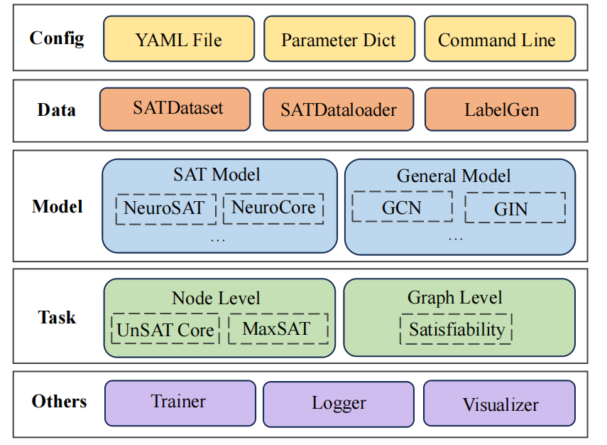

.. SATGL documentation master file, created by
   sphinx-quickstart on Wed Feb  7 13:54:49 2024.
   You can adapt this file completely to your liking, but it should at least
   contain the root `toctree` directive.

Welcome to SATGL's documentation!
=================================

.. toctree::
   :maxdepth: 1
   :caption: Get Started

   get_started/index
   get_started/quick_start

.. toctree::
   :maxdepth: 1
   :caption: User Guide

   user_guide/config_intro
   user_guide/data_intro
   user_guide/model_intro
   user_guide/task_intro
   user_guide/trainerflow

.. toctree::
   :maxdepth: 1
   :caption: Develop Guide

   developer_guide/overall
   developer_guide/customize_data
   developer_guide/customize_models
   developer_guide/customize_trainers
