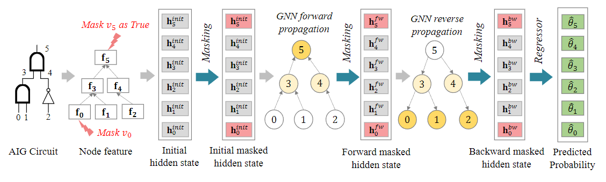

DeepSAT
==============

Introduction
------------------

`[paper] <https://api.semanticscholar.org/CorpusID:249152213>`_

**Title:** On EDA-Driven Learning for SAT Solving

**Authors:** Min Li and Zhengyuan Shi and Qiuxia Lai and Sadaf Khan and Shaowei Cai and Qiang Xu

**Abstract:** We present DeepSAT, a novel end-to-end learning framework for the Boolean satisfiability
(SAT) problem. Unlike existing solutions trained on random SAT instances with relatively weak supervision,
we propose applying the knowledge of the well-developed electronic design automation (EDA) field for SAT
solving. Specifically, we first resort to logic synthesis algorithms to pre-process SAT instances into
optimized and-inverter graphs (AIGs). By doing so, the distribution diversity among various SAT instances
can be dramatically reduced, which facilitates improving the generalization capability of the learned
model. Next, we regard the distribution of SAT solutions being a product of conditional Bernoulli
distributions. Based on this observation, we approximate the SAT solving procedure with a conditional
generative model, leveraging a novel directed acyclic graph neural network (DAGNN) with two polarity
prototypes for conditional SAT modeling. To effectively train the generative model, with the help of
logic simulation tools, we obtain the probabilities of nodes in the AIG being logic '1' as rich
supervision. We conduct comprehensive experiments on various SAT problems. Our results show that,
DeepSAT achieves significant accuracy improvements over state-of-the-art learning-based SAT solutions,
especially when generalized to SAT instances that are relatively large or with diverse distributions.

**Config**

.. code:: python

    dataset_name: satisfiability
    load_split_dataset: True
    feature_type: all_one
    task: satisfiability
    graph_type: aig
    task_level: graph
    dataset_path: ./dataset/satisfiability

    # model settings
    model_settings:
      model: deepsat
      hidden_size: 128
      dropout_ratio: 0.3
      loss: binary_cross_entropy
      num_fc: 3
      num_round: 10
      dropout_ratio: 0
      mask: False
      reverse: false
      sigmoid: True
      pooling: mean

    scheduler_settings:
      scheduler: ReduceLROnPlateau
      patience: 10
      factor: 0.5
      mode: min

    # train settings
    epochs: 100
    lr: 0.0001
    weight_decay: 1e-10
    device: cuda:5
    split_ratio: [0.6, 0.2, 0.2]
    batch_size: 16

    #log settings
    log_file: ./log/deepsat.log
