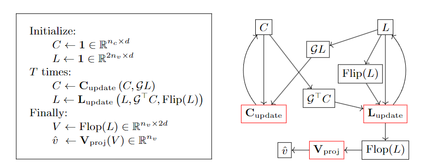

NeuroCore
==============

Introduction
------------------

`[paper] <https://api.semanticscholar.org/CorpusID:81978977>`_

**Title:** Guiding High-Performance SAT Solvers with Unsat-Core Predictions

**Authors:** Daniel Selsam and Nikolaj S. Bj{\o}rner

**Abstract:** The NeuroSAT neural network architecture was introduced in [37] for predicting properties
of propositional formulae. When trained to predict the satisfiability of toy problems, it was shown to find
solutions and unsatisfiable cores on its own. However, the authors saw "no obvious path" to using the
architecture to improve the state-of-the-art. In this work, we train a simplified NeuroSAT architecture
to directly predict the unsatisfiable cores of real problems. We modify several state-of-the-art SAT
solvers to periodically replace their variable activity scores with NeuroSAT's prediction of how likely
the variables are to appear in an unsatisfiable core. The modified MiniSat solves 10% more problems on
SATCOMP-2018 within the standard 5,000 second timeout than the original does. The modified Glucose solves
11% more problems than the original, while the modified Z3 solves 6% more. The gains are even greater when
the training is specialized for a specific distribution of problems; on a benchmark of hard problems from
a scheduling domain, the modified Glucose solves 20% more problems than the original does within a one-hour
timeout. Our results demonstrate that NeuroSAT can provide effective guidance to high-performance SAT
solvers on real problems.

**Config**

.. code:: python

    dataset_name: neurosat
    load_split_dataset: True
    feature_type: all_one
    task: satisfiability
    task_type: lcg
    task_level: graph
    load_field: ["label:float"]
    dataset_path: ./dataset/my_3_sat_1000

    model_settings:
      model: neurocore
      input_size: 1
      hidden_size: 128
      output_size: 1
      loss: binary_cross_entropy
      num_fc: 3
      num_round: 32
      dropout_ratio: 0
      sigmoid: True
      pooling: mean

    scheduler_settings:
      scheduler: ReduceLROnPlateau
      patience: 10
      factor: 0.5
      mode: min

    # train settings
    valid_metric: acc
    epochs: 100
    lr: 1e-4
    weight_decay: 1e-10
    device: cuda:5
    split_ratio: [0.6, 0.2, 0.2]
    batch_size: 32
    save_model: ./save_model/neurocore.pt

    #log settings
    log_file: ./log/neurocore.log

