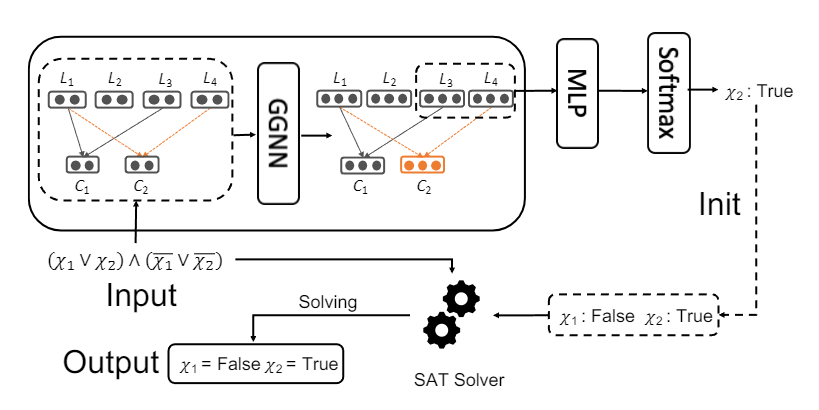

NLocalSAT
==============

Introduction
------------------

`[paper] <https://api.semanticscholar.org/CorpusID:210920254>`_

**Title:** NLocalSAT: Boosting Local Search with Solution Prediction

**Authors:** Wenjie Zhang and Zeyu Sun and Qihao Zhu and Ge Li and Shaowei Cai and Yingfei Xiong and Lu Zhang

**Abstract:** The Boolean satisfiability problem (SAT) is a famous NP-complete problem in computer
science. An effective way for solving a satisfiable SAT problem is the stochastic local search (SLS).
However, in this method, the initialization is assigned in a random manner, which impacts the
effectiveness of SLS solvers. To address this problem, we propose NLocalSAT. NLocalSAT combines SLS with
a solution prediction model, which boosts SLS by changing initialization assignments with a neural
network. We evaluated NLocalSAT on five SLS solvers (CCAnr, Sparrow, CPSparrow, YalSAT, and probSAT)
with instances in the random track of SAT Competition 2018. The experimental results show that solvers
with NLocalSAT achieve 27% ~ 62% improvement over the original SLS solvers.

**Config**

.. code:: python

    dataset_name: neurosat
    load_split_dataset: True
    feature_type: all_one
    task: satisfiability
    task_type: lcg
    task_level: graph
    load_field: ["label:float"]
    dataset_path: ./dataset/my_3_sat_1000

    model_settings:
      model: nlocalsat
      input_size: 1
      hidden_size: 128
      output_size: 1
      loss: binary_cross_entropy
      num_fc: 3
      num_round: 32
      dropout_ratio: 0
      sigmoid: True
      pooling: mean

    scheduler_settings:
      scheduler: ReduceLROnPlateau
      patience: 10
      factor: 0.5
      mode: min

    # train settings
    valid_metric: acc
    epochs: 100
    lr: 1e-4
    weight_decay: 1e-10
    device: cuda:6
    split_ratio: [0.6, 0.2, 0.2]
    batch_size: 32
    save_model: ./save_model/nlocalsat.pt

    #log settings
    log_file: ./log/nlocalsat.log
