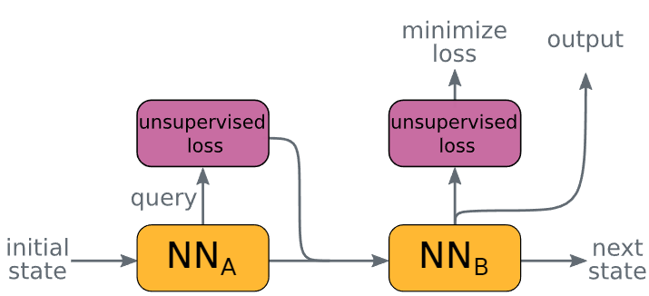

QuerySAT
==============

Introduction
------------------

`[paper] <https://api.semanticscholar.org/CorpusID:235422359>`_

**Title:** Goal-Aware Neural SAT Solver

**Authors:** Emils Ozolins and Karlis Freivalds and Andis Draguns and Eliza Gaile and Ronalds Zakovskis and Sergejs Kozlovics

**Abstract:** Modern neural networks obtain information about the problem and calculate the output solely
from the input values. We argue that it is not always optimal, and the network's performance can be
significantly improved by augmenting it with a query mechanism that allows the network at run time to
make several solution trials and get feedback on the loss value on each trial. To demonstrate the
capabilities of the query mechanism, we formulate an unsupervised (not depending on labels) loss function
for Boolean Satisfiability Problem (SAT) and theoretically show that it allows the network to extract
rich information about the problem. We then propose a neural SAT solver with a query mechanism called
QuerySAT and show that it outperforms the neural baseline on a wide range of SAT tasks.

**Config**

.. code:: python

    dataset_name: neurosat
    load_split_dataset: True
    feature_type: all_one
    task: satisfiability
    task_type: lcg
    task_level: graph
    load_field: ["label:float"]
    dataset_path: ./dataset/my_3_sat_1000

    model_settings:
      model: querysat
      input_size: 1
      hidden_size: 128
      pad_size: 4
      output_size: 1
      dropout_ratio: 0.3
      loss: binary_cross_entropy
      num_fc: 3
      num_round: 32
      dropout_ratio: 0
      sigmoid: True
      pooling: mean

    scheduler_settings:
      scheduler: ReduceLROnPlateau
      patience: 10
      factor: 0.5
      mode: min

    # train settings
    valid_metric: acc
    epochs: 100
    lr: 1e-4
    weight_decay: 1e-10
    device: cuda:7
    split_ratio: [0.6, 0.2, 0.2]
    batch_size: 32
    save_model: ./save_model/querysat.pt

    #log settings
    log_file: ./log/querysat.log

