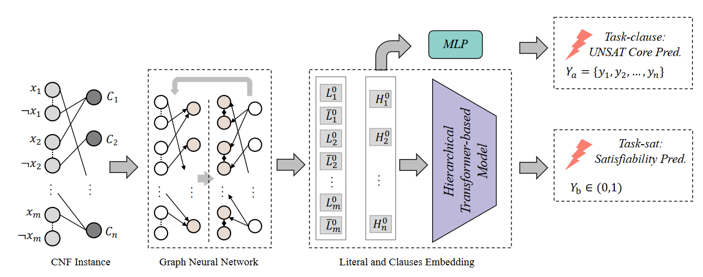

SATFormer
==============

Introduction
------------------

`[paper] <https://api.semanticscholar.org/CorpusID:265525659>`_

**Title:** SATformer: Transformer-Based UNSAT Core Learning

**Authors:** Zhengyuan Shi and Min Li and Yi Liu and Sadaf Khan and Junhua Huang and Hui-Ling Zhen and Min jie Yuan and Qiang Xu

**Abstract:** This paper introduces SATformer, a novel Transformer-based approach for the Boolean
Satisfiability (SAT) problem. Rather than solving the problem directly, SATformer approaches the
problem from the opposite direction by focusing on unsatisfiability. Specifically, it models clause
interactions to identify any unsatisfiable sub-problems. Using a graph neural network, we convert
clauses into clause embeddings and employ a hierarchical Transformer-based model to understand clause
correlation. SATformer is trained through a multi-task learning approach, using the single-bit
satisfiability result and the minimal unsatisfiable core (MUC) for UNSAT problems as clause supervision.
As an end-to-end learning-based satisfiability classifier, the performance of SATformer surpasses that of
NeuroSAT significantly. Furthermore, we integrate the clause predictions made by SATformer into modern
heuristic-based SAT solvers and validate our approach with a logic equivalence checking task. Experimental
results show that our SATformer can decrease the runtime of existing solvers by an average of 21.33%.

**Config**

.. code:: python

    dataset_name: neurosat
    load_split_dataset: True
    feature_type: all_one
    task: satisfiability
    task_type: lcg
    task_level: graph
    load_field: ["label:float"]
    dataset_path: ./dataset/my_3_sat_1000

    model_settings:
      model: satformer
      input_size: 1
      hidden_size: 128
      output_size: 1
      dropout_ratio: 0
      loss: binary_cross_entropy
      num_fc: 3
      num_round: 10
      dropout_ratio: 0
      window_size: 4
      hierarchical_level: 4
      num_head: 8
      pooling: max
      is_sat_weight: 1
      unsat_core_weight: 1
      sigmoid: True

    scheduler_settings:
      scheduler: ReduceLROnPlateau
      patience: 10
      factor: 0.5
      mode: min

    # train settings
    valid_metric: acc
    epochs: 100
    lr: 1e-4
    weight_decay: 1e-10
    device: cuda:4
    split_ratio: [0.6, 0.2, 0.2]
    batch_size: 32

    #log settings
    log_file: ./log/satformer.log

